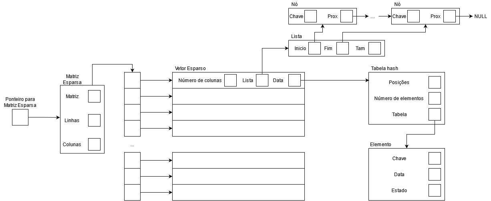

# Matriz-Esparsa
Trabalho final da disciplina de algoritmos e estrutura de dados II - UTFPR, Campo Mourão.

Este trabalho se trata da implementação de uma matriz esparsa, organizada em vetores (também esparsos) que fazem uso da estrutura de dados conhecida como tabela hash (hash table), em endereçamento aberto para o armazenamento de dados e suas respectivas chaves e uma lista encadeada que mapeia as posições das respectivas chaves do vetor esparso. 
 
A estruturação do TAD desta implementação está representada na imagem abaixo:


## Como executar
1. **Clone o repositório**
```
git clone https://github.com/Arthurdshan/Matriz-Esparsa.git
```
2. **Acesse a pasta contendo o código fonte**
```
cd src
```
3. **Compile o código com o Makefile**

Para Windows:
```
mingw32-make
```
para Linux:
```
make
```
4. **Execute o .exe**
```
./main
```
**Nota:** O arquivo "testes_TAD.c" possui todos os casos de teste, portanto não se faz necessário passar argumentos pelo argc e argv.
